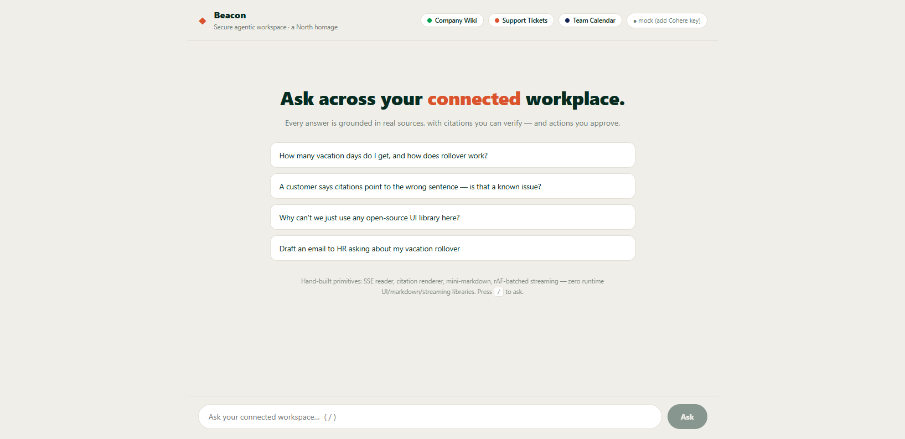
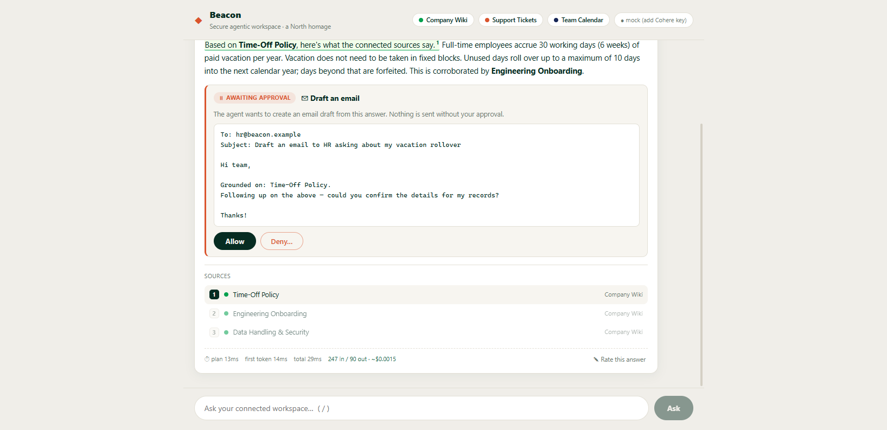
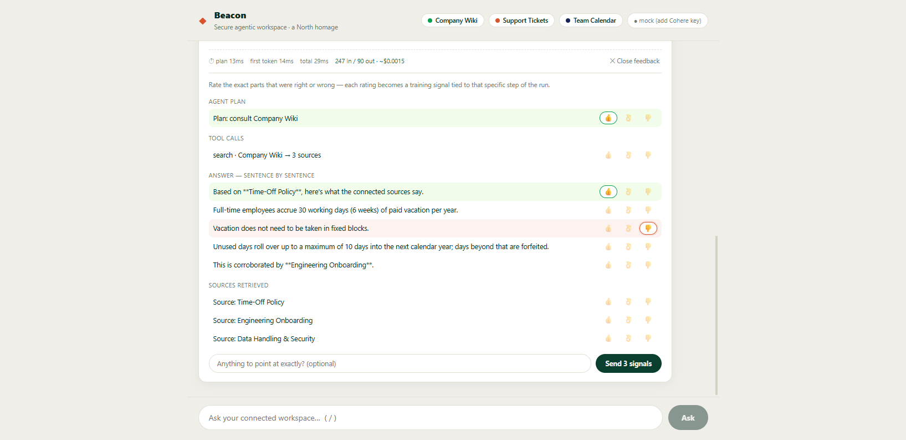

# Beacon — a grounded agentic workspace

A working miniature of a secure enterprise AI workspace (an homage to
[Cohere North](https://cohere.com/north)): an agent that plans, searches connected
workplace sources, answers **grounded in citations you can verify**, proposes
actions **you approve**, and collects **span-level feedback** good enough to train on.

**Zero runtime UI/markdown/streaming libraries. 65 KB gzipped.** Built for the
constraint that defines this product category: frontends that ship into
air-gapped, low-resource environments where you can't just `npm install` your way out.



## What it does

| Pillar | In Beacon |
|---|---|
| **Discover** | Plan → scoped tool calls → embed/rerank retrieval → grounded answer with inline citation spans. Hover a citation ⇄ its source highlights. |
| **Automate** | The agent *proposes* side-effecting actions (draft an email); a human allows or denies — with an optional reason the agent learns from. |
| **Improve** | Every reply decomposes into ratable segments (plan / tool calls / answer sentences / sources). Each 👍👌👎 is stored as a run-scoped JSONL training record. |




## Run it (no API key needed)

```bash
# backend — mock mode works fully offline
cd backend
python -m venv .venv && .venv/Scripts/pip install -r requirements.txt   # Windows
.venv/Scripts/python -m uvicorn main:app --port 8000

# frontend
cd frontend
npm install && npm run dev   # http://localhost:5173
```

Add a free Cohere trial key to `backend/.env` (see `.env.example`) to switch from
mock to live Command + Embed + Rerank.

## The engineering story

- **Citation spans are untrusted input.** Model offsets drift from rendered text
  (markdown stripped, bold rendered). The hand-built renderer clamps every span,
  snaps to word boundaries, and drops overlaps — a citation must never slice a word.
- **Tokens outpace paint.** Streamed tokens are batched with `requestAnimationFrame`
  — one React commit per frame, not per token.
- **Permission before retrieval.** Connector toggles filter the agent's plan
  *before* documents are fetched — unauthorized text never enters the prompt.
- **Cost is part of the interface.** Every run renders its own latency trace and
  estimated token spend.
- **Hand-built primitives:** SSE reader over `fetch`, citation renderer,
  mini-markdown, all dependency-free — because in this product category, sometimes
  you can't use the popular library.

Deep dives: [How it was built](docs/how-it-was-built.md) ·
[Build evidence receipt](build-evidence.md) ·
[62-second demo video](demo/beacon-demo.mp4)
([the demo records itself](demo/record-demo.mjs) — a Playwright script drives the
live deployment with on-screen captions)

## Stack

FastAPI + Cohere v2 SDK (Python) · React 19 + TypeScript strict (Vite) ·
SSE streaming of 10 typed event kinds · deployable as a single Vercel project.

---

*Deepak Singh Kandari — built as the portfolio centerpiece for Cohere's
Senior Full-Stack (Front-End Leaning), Agentic Platform role.*
